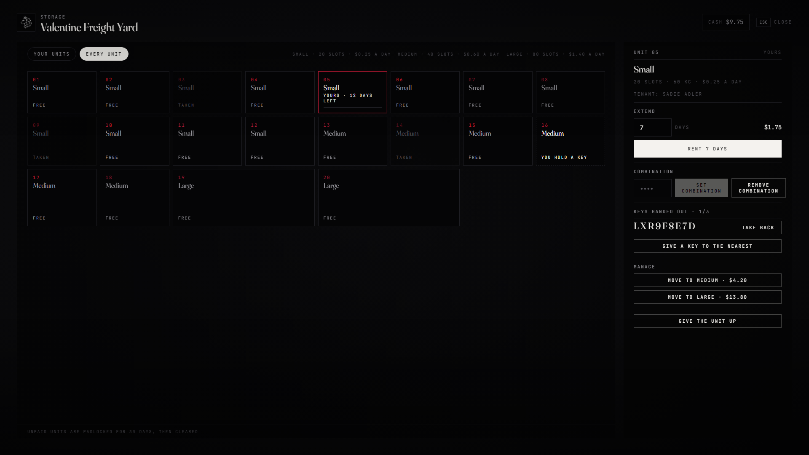

# lxr-storage — Rented lock-ups, for LXRCore

A warehouse keeper at each yard rents numbered units by the day — small,
medium, large. Rent runs out, the unit is padlocked and the keeper keeps
what is inside until it is paid; a month unpaid and it is cleared. A
tenant can hand out keys, set a combination, or move up to a bigger unit.
Every unit is an lxr-inventory stash; the keeper's book is this resource.



## What it does

* **Yards** — `Config.Yards`: a keeper ped (the book), a door (the units), how many of each size, a price multiplier.
* **The book** — every unit as a tile: free, yours (days left), taken, or a key you hold. Rent 1–`maxDays` days, extend, set or remove a 3–6 digit combination, hand a key to the nearest player (up to `keys`), take a key back, move to a bigger unit (the rent difference for the days left; the goods move with you), give the unit up.
* **The door** — a menu of the units you may open, or *open with a combination* for anyone who was told the numbers.
* **The clock** — `paid` → `locked` (no access for `graceDays`) → `cleared` (emptied, free again).
* **The law** — a lawman on duty (`Config.Search`: job types, minimum grade) may search any rented unit from the door; the tenant is told, the search is logged and `lxr:storage:searched` is emitted.
* **Events** — `lxr:storage:rented`, `lxr:storage:opened`, `lxr:storage:searched`.

## Install

```cfg
ensure lxr-core
ensure lxr-nui
ensure lxr-inventory
ensure lxr-interact
ensure lxr-storage
```

The table `lxr_storage_units` is created by the core migration runner.

## API

| Name | Side | Purpose |
|---|---|---|
| `UnitsOf(citizenid)` | server | a citizen's tenancies |
| `MayOpen(citizenid, yard, no)` | server | key or tenancy check |
| `IsOpen()` | client | book state |

## Building the interface

Vite + React + TypeScript: source in `ui/`, built output in `html/` (`cd ui && npm install && npm run build`). `style.css` uses kit tokens only; `tools/kit_check.py` guards it.

## Licence

© 2026 iBoss21 / LXRCore — All Rights Reserved. See `LICENSE`.
